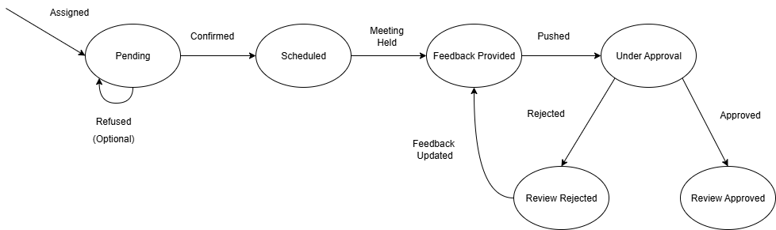

# Company Management & Performance Review System  

## 📑 Table of Contents  
1. [Overview](#1-overview)  
2. [Project Setup](#2-project-setup-)  
3. [Implementation Details](#3-implementation-details)  
4. [Assumptions & Considerations](#4-assumptions--considerations)  
5. [Security Measures](#5-security-measures)  
6. [API Endpoints](#6-api-endpoints)  
7. [Task Completion Checklist](#7-task-completion-checklist-)  
  

---

## 1. Overview
This project implements a role-based company management and performance review system using **Django + Django REST Framework**.  

It provides:  
- Management of companies, departments, and employees.  
- Role-based access control for different user types (Admin, HR, Manager, Employee).  
- A performance review workflow (assign → confirm → feedback → approval/rejection).  
- JWT authentication for secure access.  
- SQLite database for development and testing.  

---

## 2. Project Setup ⚙️

### Installation

1. **Make sure you have Python 3.10+ installed**

2. **Create an empty folder, within it create a Python virtual environment:**

   ```bash
   python -m venv django-env
   ```

3. **Clone this repository to your local machine:**

   ```bash
   git clone https://github.com/Mohamed-Senary/Brainwise-Task.git
   cd Brainwise-Task
   ```

4. **Activate the Python virtual environment:**

   ```bash
   # Windows
   ../django-env/Scripts/Activate
   
   # Linux/macOS
   source ../django-env/bin/activate
   ```

5. **Install the necessary requirements:**

   ```bash
   pip install -r requirements.txt
   ```

6. **Make migrations and migrate the database:**

   ```bash
   python manage.py makemigrations
   python manage.py migrate
   ```

7. **Run the application server locally:**

   ```bash
   python manage.py runserver
   ```

8. **Follow the link in the terminal** (usually `http://127.0.0.1:8000/`)

9. **Check the API documentation** for the different endpoints

---

## 3. Implementation Details

### 🔹 Accounts App  
- Custom user model (`UserAccount`) with four roles: **Admin**, **HR**, **Manager**, **Employee** and Sign in Using email not username.
- Encode role in JWT token
- Registeration and SignIn functionalities  
- Provides the base authentication and role definitions.  
- Role-based permissions (`IsAdmin`, `IsHR`, `IsManager`, `IsEmployee`) implemented here.
#### Permissions Matrix:
| Entity / Action | Admin | Manager | HR | Employee |
|---|---|---|---|---|
| View Company | ✅ | ✅ |  | ❌ |
| View Dept | ✅ |  | ✅ | ❌ |
| Employee (CRUD) | ✅ Full | View Only | ✅ Full | ❌ |
| Performance Review | ❌ | Approve / Reject only | Create, Schedule, Provide Feedback, Push for Approval | View own review, Accept |  

### 🔹 Company App  
- Responsible for managing **companies, departments, and employees**.  
- CRUD endpoints provided for companies and departments.  
- Employees can be listed, created, retrieved, updated, and deleted.  
- Supports filtering employees by `company` and/or `department` via query parameters.  
  - Example:  
    - `/api/company/employee/?company=1`  
    - `/api/company/employee/?department=2`  
    - `/api/company/employee/?company=1&department=2`  

### 🔹 Reviews App  
- Responsible for managing **performance reviews**.  
- `PerformanceReview` model added to represent review lifecycle.  
- Workflow transitions:  
  - `PENDING → SCHEDULED` (employee confirms)  
  - `SCHEDULED → FEEDBACK_PROVIDED` (HR provides feedback)  
  - `FEEDBACK_PROVIDED → UNDER_APPROVAL` (HR pushes forward)  
  - `UNDER_APPROVAL → APPROVED/REJECTED` (Manager decides)  
 
 

---

## 4. Assumptions & Considerations
- Employees are treated as a **manageable entity** (model `Employee`) rather than being tied directly to `UserAccount` via foreign key.  
- A `PerformanceReview` model was introduced (not explicitly in requirements) to manage workflow and state transitions.  
- **HR role clarified**: HR schedules and provides feedback, while Managers handle approvals/rejections.  
- **HR employees** do not receive performance reviews themselves (assumed).  
- Only HR/Admin can create employees (restricted at view level).  
- Managers cannot create or edit employees.  

---

## 5. Security Measures
- **JWT authentication**: all endpoints protected by token-based auth.  
- **Role-Based Access Control (RBAC)**: enforced through custom permission classes.  
- Sensitive actions (creating employees, assigning reviews, approving/rejecting) are strictly tied to roles.  

---

## 6. API Endpoints

### 🔹 Accounts
| Method | Endpoint | Description | Roles Allowed | Notes |
|--------|----------|-------------|---------------|-------|
| POST | `/api/accounts/register/` | Register User| AllowAny | |
| POST | `/api/accounts/login/` | Obtain JWT token pair|AllowAny | |
| POST | `/api/token/refresh/` |Obtain new JWT refresh token|IsAuthenicated | |

### 🔹 Company & Employee Management  
| Method | Endpoint | Description | Roles Allowed | Notes |
|--------|----------|-------------|---------------|-------|
| GET | `/api/company/` | List companies | Admin, HR, Manager | |
| GET | `/api/company/<id>/` | Retrieve single company | Admin, HR, Manager | |
| GET | `/api/company/department/` | List departments | Admin, HR, Manager | Optional query: `company=<id>` |
| GET | `/api/company/department/<id>/` | Department details | Admin, HR, Manager | |
| GET | `/api/company/employee/` | List employees | Admin, HR, Manager | Optional queries: `company=<id>`, `department=<id>` |
| POST | `/api/company/employee/` | Create employee | Admin, HR | |
| GET | `/api/company/employee/<id>/` | Get employee details | Admin, HR, Manager | |
| PUT/PATCH/DELETE | `/api/company/employee/<id>/` | Edit/Delete employee | Admin, HR | |

### 🔹 Performance Reviews  
| Method | Endpoint | Description | Roles Allowed |
|--------|----------|-------------|---------------|
| GET | `/api/reviews/` | List all reviews (filterable) | Admin, HR, Manager |
| GET | `/api/reviews/<id>/` | Retrieve single review | Admin, HR, Manager |
| GET | `/api/reviews/emp-reviews/` | Employee lists their own reviews | Employee |
| POST | `/api/reviews/assign/` | Assign review | HR |
| PATCH | `/api/reviews/<id>/confirm/` | Confirm review (PENDING → SCHEDULED) | Employee |
| PATCH | `/api/reviews/<id>/feedback/` | Provide feedback | HR |
| PATCH | `/api/reviews/<id>/push/` | Push for approval | HR |
| PATCH | `/api/reviews/<id>/approve/` | Approve review (UNDER_APPROVAL → APPROVED) | Manager |
| PATCH | `/api/reviews/<id>/reject/` | Reject review (UNDER_APPROVAL → REJECTED) | Manager |

---

## 7. Task Completion Checklist ✅

- [x] Implement role-based authentication and permissions
- [x] Manage companies, departments, and employees
- [x] Implement performance review model and lifecycle
- [x] Enforce role-based access control on all endpoints
- [x] Secure endpoints using JWT authentication
- [x] Write unit tests for authentication, permissions, company/dept/employee CRUD and review workflow
- [ ] Integration Tests (PARTIAL)
- [ ] Project CRUD (BONUS)
- [ ] Logging (BONUS)
---
